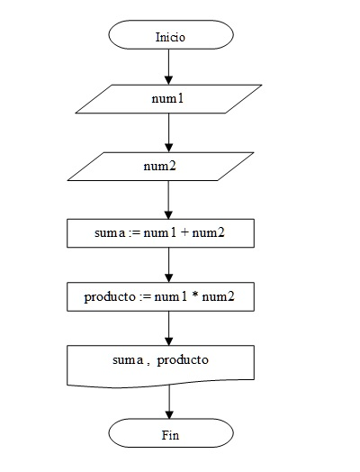
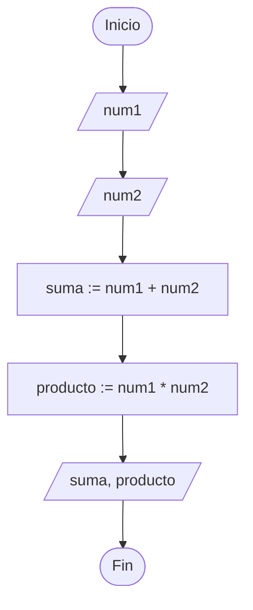

# 3. Programación Secuencial

Cuando en un programa sólo participan operaciones, entradas y salidas se la denomina una **estructura secuencial**.

```mermaid
flowchart TD
    A([Inicio]) --> B[/num1/]
    B --> C[/num2/]
    C --> D[suma := num1 + num2]
    D --> E[producto := num1 * num2]
    E --> F[/suma, producto/]
    F --> G([Fin])
```
