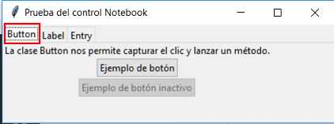
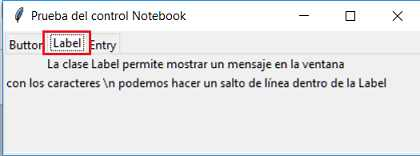

### Controles Notebook y Frame

La clase **Notebook** permite crear un cuaderno con pestañas en la parte superior. En cada pestaña asociamos un objeto de la clase **Frame** y dentro de esta podemos crearr controles visuales como pueden ser Label, Button, Radiobutton, etc.

Un ejemplo visual de un Notebook es:

Según la pestaña seleccionada se muestra un Frame con distintos controles visuales:

