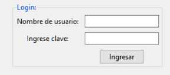

### Control Labelframe

Un **LabelFrame** es un **contenedor con borde y una etiqueta**, que agrupa visualmente a otros widgets relacionados como Button, Label, Entry, etc.

Un ejemplo de LabelFrame con 2 Label, 2 Entry y un Button es:

